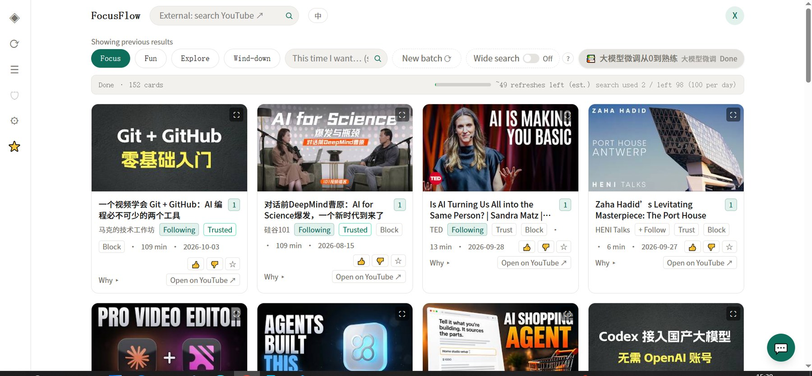
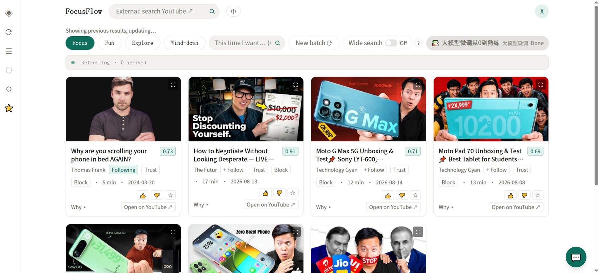
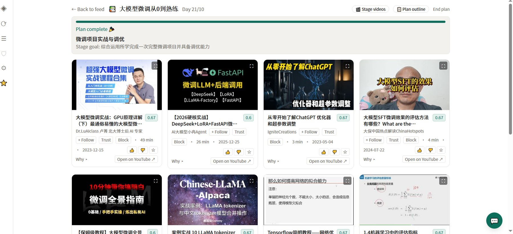
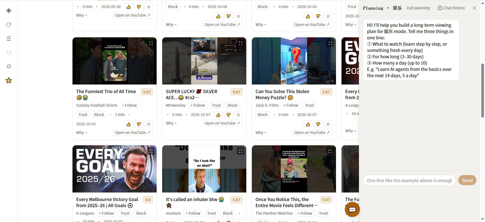
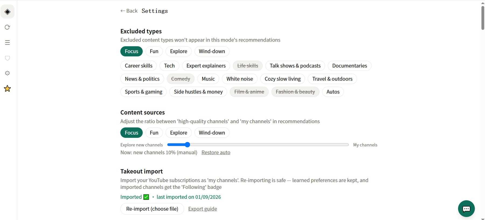
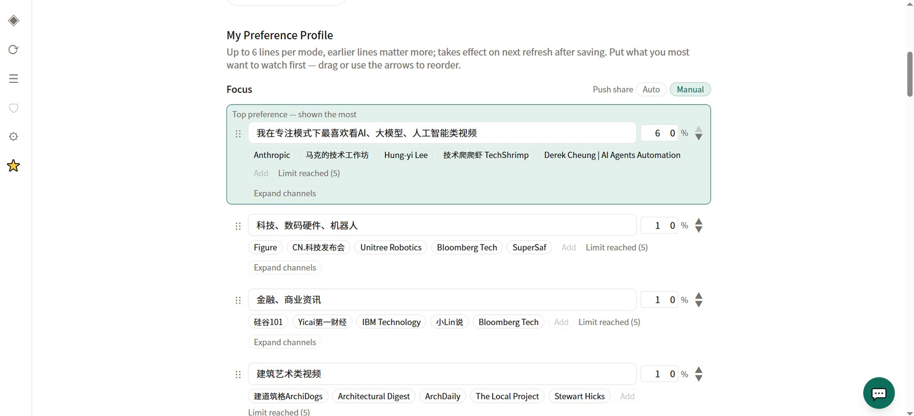
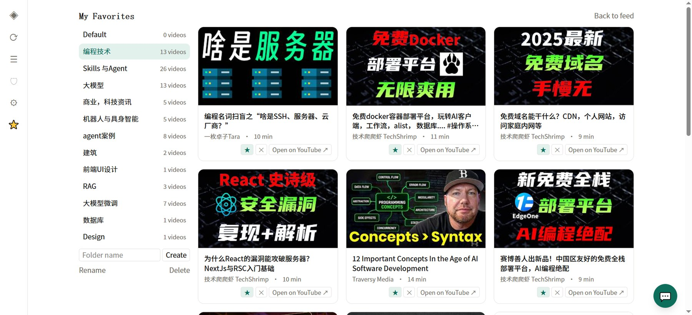
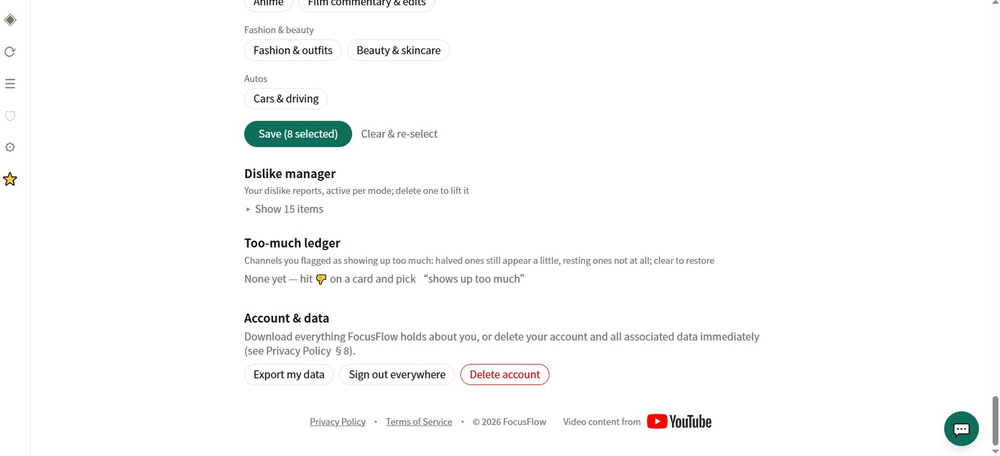
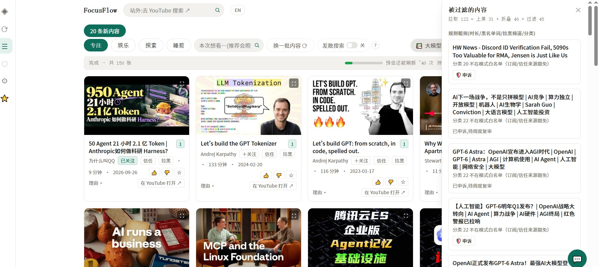
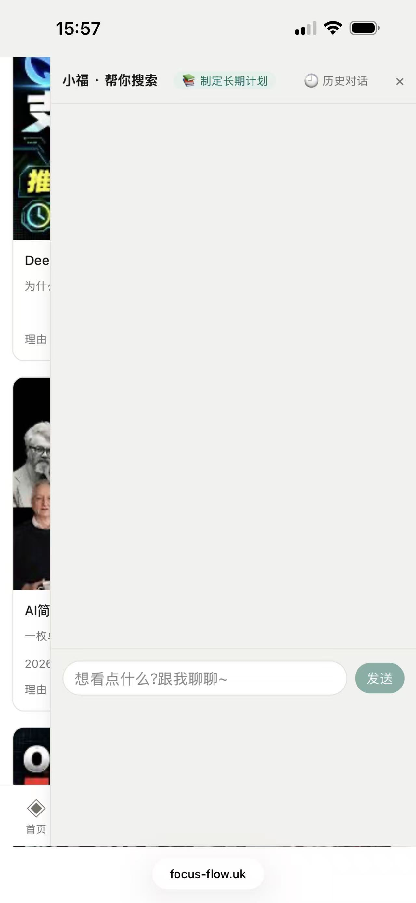

# FocusFlow

**先声明意图、再看内容的视频推荐系统。它是守门人,不是信息流。**

线上:**https://focus-flow.uk** · [English README](README.md) · [架构说明](docs/architecture.md) · [关键决策](docs/decisions.md) · [精选代码](code-samples/) · [路线图](docs/roadmap.md)

> 这是一个私有代码库的公开展示仓。这里有架构、关键决策的来龙去脉、生产环境的数字,以及几段清理过的代码摘录。完整源码可应面试与评审需要提供,见[这里没有什么](#这里没有什么)。

---

## 问题

主流视频平台以停留时长为优化目标。你带着目的打开应用,一小时后被喂饱了离开。FocusFlow 把这个契约反过来:**用户先声明意图,系统再把世界过滤到只剩符合意图的内容。** 意图之外的东西一律不出现,而每一条被滤掉的视频都写进一本用户可查、可申诉的账。

它建在 YouTube 公开的 Data API 之上,数据永远不可能比 YouTube 自己的排序器丰富。这个项目押的是:数据更少但意图明确的系统,能比数据齐全但没有意图的系统给出更好的一次使用。

## 它做什么

| 产品原则 | 具体体现 |
|---|---|
| **意图先于内容** | 四个模式(专注、娱乐、探索、睡前),各有自己的内容白名单、时长窗口和质量线。看到第一张卡之前必须先选模式。也可以输入一句临时意图,覆盖本次会话的检索计划。 |
| **受保护的观看环境** | 站内嵌入播放,无侧栏推荐、无自动连播。「在 YouTube 打开」存在,但它是一个显式的、用户自知的出口。 |
| **有限,而且是故意的** | 一次刷新产出一批卡片加一个折叠区。没有无限滚动。看完这批,就是看完了。 |
| **没有黑箱** | 每条被拒的视频都记录在哪个阶段、被哪条规则拒掉。侧栏可以看这本账。用户可以申诉,申诉通过即成为长期豁免。 |
| **不做可见的用户画像** | 系统内部维护偏好状态,但用户永远不会看到「我们认为你是这样的人」的面板。个性化由用户用自己的话写下的条目驱动,可以随时改、随时删。 |
| **进度透明** | 结果通过 Server-Sent Events 一波一波流式到达,界面显示当前在哪个阶段。上次的结果会先铺上屏(实测 21 毫秒),永远没有白屏。 |

## 它怎么工作

一次刷新走一条固定的流水线。各阶段互不 import,由唯一的编排器串起来,结果一出来就流式推出。

| 阶段 | 名称 | 成本 | 职责 |
|---|---|---|---|
| S0 | 状态 | 纯代码 | 按用户与模式的状态机,决定重新规划还是复用上次计划。 |
| S1 | 规划 | LLM,有纯代码降级 | 选 2~6 条检索策略,并给每条分配可花的 API 配额。 |
| S2 | 抓取 | YouTube API | 跨订阅频道、精选频道池、搜索和本地候选库执行计划。 |
| S3 | 粗筛 | 纯代码 | 黑名单、时长窗口、类型规则。零成本。 |
| S4 | 分诊 | 纯代码 | 把候选分成「直通」「缓存命中」「待复核」三桶。这是 LLM 成本的总闸门。 |
| S5 | 质量判官 | LLM | 只审「待复核」桶,按批、并发。 |
| S6 | 模式契合判官 | LLM | 裁定每条候选是否符合声明的模式和用户自己写的画像条目。带 7 天缓存。 |
| S7 | 排除 | 纯代码 | 应用用户在每个模式下排除的内容类型。 |
| rank | 排序 | 纯代码 | 加权打分,再按多样性、关注频道、用户点名的种子频道做席位规则。 |

每次运行以一个守恒校验收尾:`进入的视频数 == 上屏数 + 折叠数 + 账本行数`。等式一破就记 error 日志。出卡数量不对劲时第一个看的就是它,它不止一次否定过错误的猜测。

更深的内容,包括编排器流程、智能体层和状态机,在 [docs/architecture.md](docs/architecture.md)。

## 数字

以下数字均来自生产环境或 2026 年 9 月下旬的代码库。

| | |
|---|---|
| 后端(Python,不含测试与脚本) | 约 23,800 行 |
| 前端(React) | 约 9,100 行 |
| 自动化测试 | 后端 pytest 1,347 条 + 前端 vitest 497 条,全绿 |
| 提交 | 664 次,2026-06-10 至 2026-09-27,持续中 |
| HTTP/SSE 端点 | 74 个 |
| 数据库表 | 37 张,全部经由一个访问模块 |
| 带版本的 prompt | 14 份,有沿革文件,基线由测试逐字节锁定 |
| 一次完整刷新墙钟时间 | 164.9 秒 → **58.3 秒**(降 65%),来自一轮以真机计时驱动的两段 LLM 并发优化 |
| 回访首屏 | 21 毫秒(流水线启动前先从本地池铺上上次结果) |

## 技术栈

- **后端:** Python 3、FastAPI、SQLite(单文件、WAL)、`sqlite-vec` + FTS5 配合 `jieba` 做中英混合检索、Pydantic AI 做带类型的 LLM 输出。
- **LLM:** 通过 Anthropic API 调用 Claude 模型。按成本分档:默认用小模型,只在实证有差异的地方用大模型。所有 LLM 调用集中在一层,每一处都有纯代码降级,模型挂了产品也不会 500。
- **数据源:** YouTube Data API v3,单一适配器,逐笔配额记账,两本独立的日预算。
- **前端:** React 18、Vite、Tailwind CSS v4、PWA,有意不用路由库和全局状态库。自建 Provider 的完整中英双语。
- **运维:** 一台小 VPS、单进程、Caddy 自动 TLS。速率限制、CSP、同意闸、删号与数据导出、30 天保留期清理。

## 截图

生产环境,英文界面。界面完整支持中英双语(顶部「中」切换)。

| 专注模式,本批完成。模式选择、临时意图框、配额条。 | 卡片流式到达中。新一批到达时先铺上上一批。 |
|---|---|
|  |  |

| 多日观看计划的阶段视图。 | 与助手对话起草计划。 |
|---|---|
|  |  |

| 设置页:按模式排除类型、来源配比、订阅导入。 | 画像条目,用户自己写、可拖动重排、可设占比。 |
|---|---|
|  |  |

| 带文件夹的收藏夹。 | 不喜欢管理、过度曝光账本、数据导出与删号。 |
|---|---|
|  |  |

| 过滤透明化,中文界面。每张被过滤的卡片都列出触发规则,可一键申诉。 | 手机端布局:助手抽屉盖在信息流之上。 |
|---|---|
|  |  |

## 我的角色

独立项目:产品定义、架构、实现、评估、运维全部一人完成。2026 年作为硕士毕业论文项目构建(*FocusFlow: A Proactive, Context-Aware Video Recommendation AI Agent Built on Explicit User Intent*),提交后继续在生产环境运行和迭代。

代码库使用 AI 结对编程工具、按「规格 → 计划 → 测试 → 评审」的工作流完成。每一批改动都从一份带编号决策的书面规格开始,带着测试落地,部署后对照生产日志验收。我把这套工作流本身视为交付物的一部分。

## 这里没有什么

这个仓库有意不包含:

- prompt 原文及其版本历史;
- 排序权重、席位数、阈值、配额预算(在私有仓里全部集中于一个配置文件);
- 频道池的构建方法和池本身;
- 部署与运维材料。

[code-samples/](code-samples/) 里的代码是为阅读而删节、清理过的摘录,不能独立运行。

**完整源码:** 可应面试官与评审需要提供。请通过简历上的邮箱联系,或在本仓开 issue。

## 许可

本仓库的文字与图表采用 [CC BY-NC-ND 4.0](LICENSE) 许可。`code-samples/` 中的摘录仅供阅读,适用同一许可。FocusFlow 源码本身为专有代码,不在本许可范围内。
