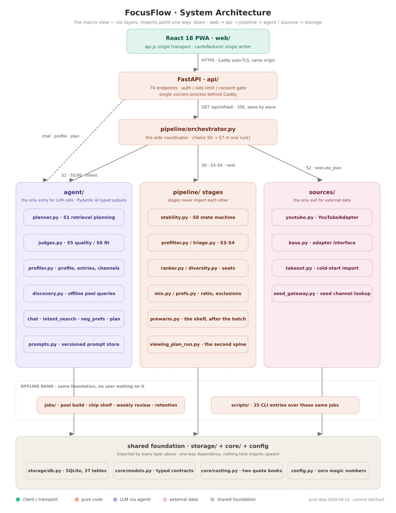
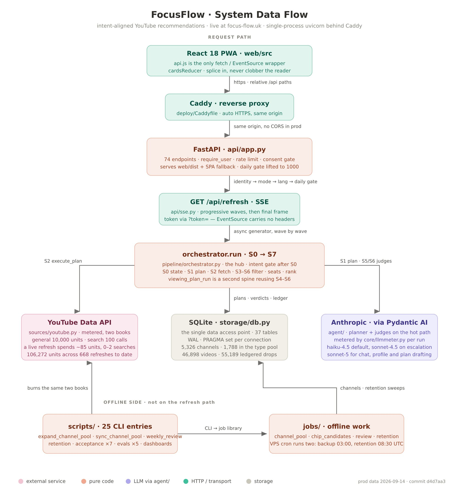
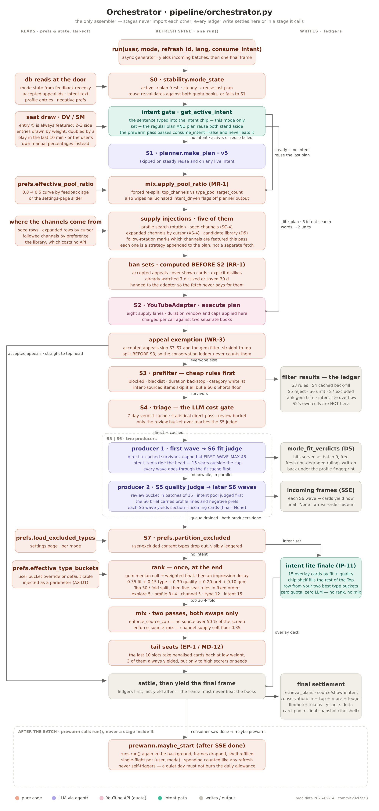
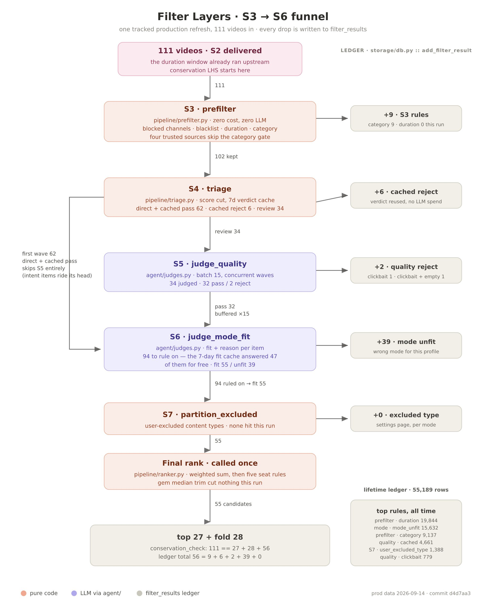
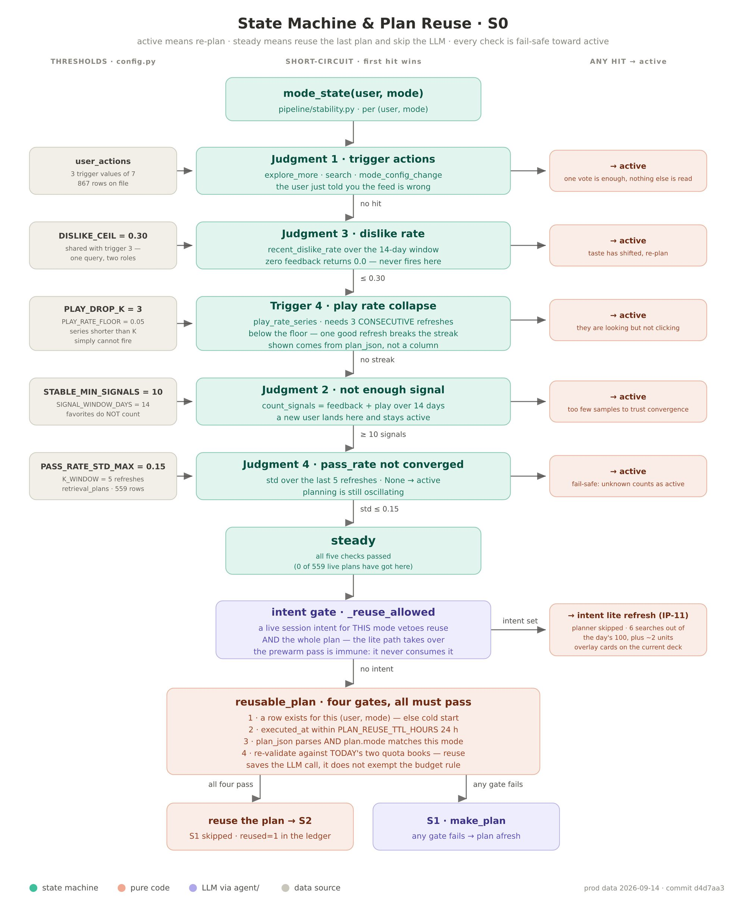
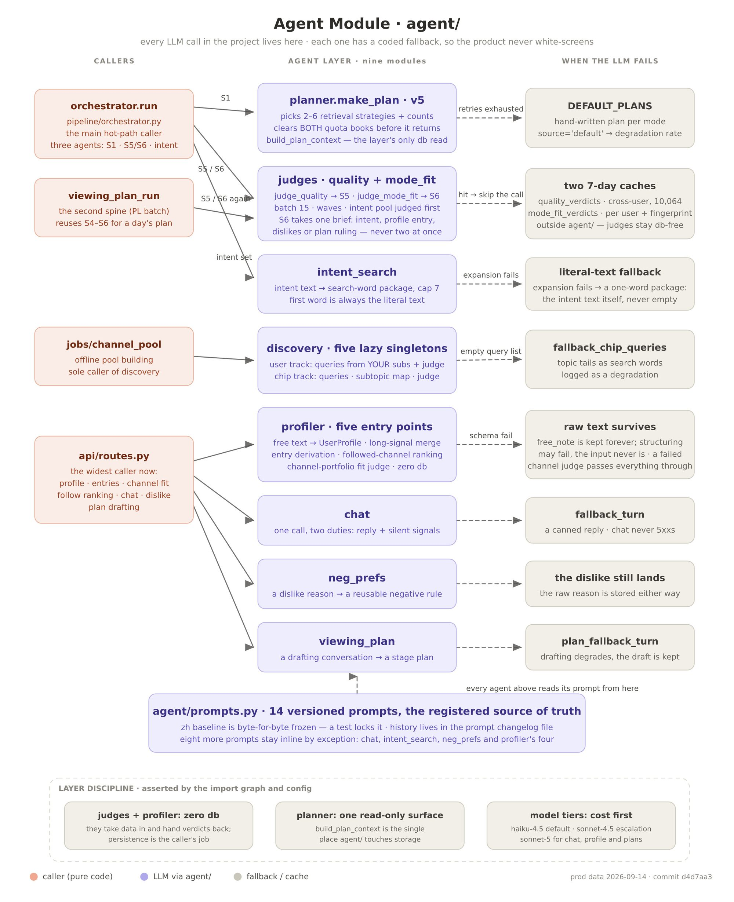
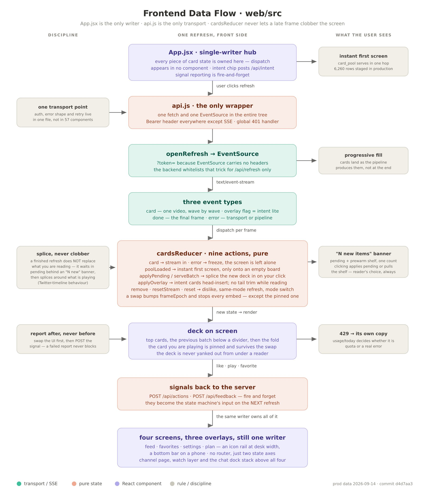

# Architecture

This document goes one level below the README: how the layers are cut, how one refresh moves through the pipeline, and where the LLM sits. It stops short of the ranking rules, seat counts, prompts and thresholds, which stay private.

All diagrams were rendered from one tracked production refresh on 2026-09-14, so the numbers on them are real.

## 1. Layers

Six layers, imports point one way only: `web → api → pipeline → agent / sources → storage`. The rules that keep it that way:

| Layer | Directory | Discipline |
|---|---|---|
| Client | `web/` | React PWA. One transport module talks to the API; one reducer is the only writer of card state. |
| Service | `api/` | FastAPI. All HTTP and SSE endpoints, auth, rate limit, consent gate. Degrades instead of erroring: an LLM outage returns a flagged, degraded response, never a 500. All logs pass through a redaction layer. |
| Decision | `pipeline/` | The S0–S7 stages plus ranking. Stages never import each other and never call an LLM or an external API directly. Only the orchestrator composes them. |
| Agent | `agent/` | **Every LLM call in the project lives here.** Each agent has a pure-code fallback. Prompts are versioned in one registry. |
| Data | `storage/` + `sources/` | SQLite behind a single module (all SQL in one file). YouTube behind a single adapter that charges every call to a quota ledger. |
| Foundation | `core/`, `config.py` | Typed models, log redaction, cost accounting. `config.py` is the only home for thresholds, weights and budgets. The modules contain zero magic numbers. |

Offline work (channel-pool building, the pre-warmed shelf, weekly review, retention sweeps) sits in `jobs/` and shares the same foundation, but no user ever waits on it.

## 2. One refresh, end to end

1. The client opens an SSE stream for a mode. Before the pipeline starts, the server replies with the previous final frame from a per-user, per-mode card pool. That is the 21 ms first paint.
2. **S0** reads the per-user, per-mode state machine (see §4). A steady state with no new intent may reuse the previous retrieval plan and skip S1.
3. **S1** asks the planner for 2–6 retrieval strategies with per-strategy quota caps. If the planner fails or the budget is exhausted, a hand-written default plan per mode is used and recorded as a degradation.
4. **S2** executes the plan: subscriptions, the curated channel pool, keyword search, the user's own seed channels, and a zero-cost local candidate library. Items the user has already consumed, disliked or seen too often are removed *before* fetching, so quota is not spent on cards that would be dropped.
5. **S3** prefilter runs the free rules. Every drop is written to the ledger.
6. **S4** triage splits survivors into `direct` (statistical quality above a bar), `cached` (an LLM verdict from the last 7 days) and `review`.
7. **S5** reviews the `review` bucket in concurrent batches. In parallel, the `direct + cached` survivors go straight to S6 as the *first wave*, so the first cards appear before S5 has finished.
8. **S6** rules on mode fit for each wave, reading a 7-day per-user cache first. Cache hits are emitted immediately with no model call.
9. **S7** applies the user's excluded content types.
10. **rank** scores once, applies seat rules, splits into `top` and `fold`, and the final frame is emitted. The conservation check runs and the plan, timings and cost are written to the ledger *before* the final frame leaves, so a client that disconnects early cannot lose the accounting.

### The streaming contract

The orchestrator is an async generator. Intermediate yields carry `section="incoming"` and fade in on arrival. The last yield is always the complete final snapshot; the client treats the final frame as authoritative and reconciles everything shown so far against it. This makes the UI safe against reordering between waves and lets the server reorder, demote or drop a card that was shown early.

## 3. Filtering as a funnel with a ledger

Three properties worth calling out:

- **Every drop has a row.** Stage, rule and reason, per video, per refresh. The side panel in the UI reads this table directly. Appeals are rows in another table, and an accepted appeal is checked before S3 on every later refresh.
- **The cost gate is a pure-code stage.** S4 decides what the LLM sees. In the tracked refresh above, 62 of 102 survivors never reached the quality judge, and the 7-day mode-fit cache answered 47 of 94 rulings for free.
- **Conservation is asserted, not assumed.** `111 == 27 + 28 + 56` on the diagram is a real check that runs after every refresh and is also asserted by the acceptance tests.

## 4. The state machine

Each (user, mode) pair has a state that decides how much work a refresh does. Signals from the client (play, like, dislike, favourite, appeal) feed it. The thresholds live in config. Three of the seven action types trigger a re-plan; the rest only adjust preference scores. A one-off typed intent short-circuits the machine for that session.

## 5. The agent layer

Nine agents, one rule: **each one has a coded path for when the model fails**, and the product has to stay usable on that path.

| Agent | When the LLM fails |
|---|---|
| Retrieval planner | Hand-written default plan per mode, flagged as degraded. |
| Quality judge / mode-fit judge | Cache hit skips the call; a failed call fails open with a `degraded` flag so the card still has a chance to appear. |
| Intent expansion | The literal intent text becomes the one-word search package. |
| Profile structuring | The user's raw text is stored first and survives even if structuring fails. |
| Chat | A canned reply; the chat endpoint never 5xxs. |
| Dislike-reason distillation | The raw reason is stored either way. |
| Viewing-plan drafting | The draft is kept, the structuring is retried later. |

Model selection is cost-first: a small model by default, escalation only where measurement showed it mattered, a larger model for the conversational surfaces where multi-turn context is the point.

Prompts live in one versioned registry. The Chinese baseline of each prompt is frozen byte-for-byte by a test; changes go through a changelog file and a script that refuses unrecorded edits.

## 6. The frontend

- **No router, no global state library.** Every "page" is a state switch in the root component; all cross-component state lives in one tree.
- **A frame model for streaming.** Cards arrive as preview frames (translucent) and settle on the final frame. A visible progress ribbon shows which stage is working. That ribbon is the product's signature, not decoration.
- **Fire-and-forget signals.** UI updates first; reporting failures never block or roll back the UI.
- **Mode is the accent colour.** A token-based theme where each mode owns a palette.
- PWA, installable on mobile, with a mobile-specific layout pass.

## 7. Retrieval: hybrid search without new infrastructure

Candidate lookup combines three signals inside the same SQLite file:

- FTS5 full-text search, with `jieba` pre-segmentation because the default tokenizer treats a run of Chinese characters as one token;
- `sqlite-vec` dense vectors from a small multilingual embedding model, computed by a nightly job;
- reciprocal rank fusion of the two, then a per-profile-entry segmentation so one dominant interest cannot crowd out the others.

Each piece sits behind a feature flag and was evaluated stage by stage against the pre-upgrade baseline before being left on.

## 8. Operations in one paragraph

One VPS, one process, Caddy for TLS, SQLite in WAL mode. Rate limiting and a content security policy at the edge; a consent gate, account deletion, data export and 30-day retention sweeps for compliance. Secrets never touch logs: a redaction layer wraps every exception path, including offline scripts. Deploys are `git pull`, build, restart.
